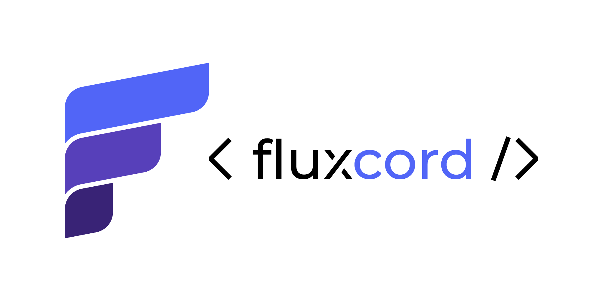

<p align="center">
	<picture>
		<source
			media="(prefers-color-scheme: dark)"
			srcset=".github/assets/horizontal-lockup-dark.png"
		/>
		
	</picture>
</p>

<div align="center">

[](https://github.com/PhoenXHO/fluxcord/actions/workflows/ci.yml)
[](https://www.npmjs.com/package/fluxcord)
[](./LICENSE)
[](https://nodejs.org)

</div>

Stateful, multi-screen Discord UIs in TSX. Built on discord.js v14
(Components V2).

A screen is a plain function of state: when a click changes that state
through a handler you wrote, the framework re-renders the screen and edits
the message, so you never touch edits or component ids yourself.

<!-- Hero demo GIF goes here once the example bot records it:

-->

## Features

- Sessions with real state: every mounted panel owns its data, a FIFO
  click queue that keeps handlers from racing each other, and an idle
  expiry swept on an interval.
- Multi-screen flows with compile-time navigation: the targets of `go`,
  `push`, and `back` are checked against your screens map by TypeScript.
- TSX authoring through a custom JSX runtime, with plain builder
  functions as the non-TSX path; both compile to the same trees.
- Handlers bound by identity, so no custom-id strings exist to parse, and
  the commit phase re-renders the screen and edits the message for you.
- Permission gates declared on flows and on single controls, decided per
  click by the policy port you wire at boot.
- Panels survive redeploys through an optional rehydrate store.
- A platform-free core with the discord.js binding isolated in a
  peer-dependent `fluxcord/discord` entry.

## The problem

Discord interactions are stateless, which means every button click arrives
as a fresh event carrying a single string, the custom id, and if your panel
has any state beyond that, you are the one carrying it.

A counter in raw discord.js:

```ts
import { ActionRowBuilder, ButtonBuilder, ButtonStyle, Events } from 'discord.js';

// the state, and its lifetime, are your problem now
const counts = new Map<string, number>();

function counterRow() {
	return new ActionRowBuilder<ButtonBuilder>().addComponents(
		new ButtonBuilder().setCustomId('counter:dec').setLabel('-1').setStyle(ButtonStyle.Secondary),
		new ButtonBuilder().setCustomId('counter:inc').setLabel('+1').setStyle(ButtonStyle.Primary),
	);
}

client.on(Events.InteractionCreate, async (interaction) => {
	if (!interaction.isButton() || !interaction.customId.startsWith('counter:')) return;
	const [, op] = interaction.customId.split(':');
	const next = (counts.get(interaction.message.id) ?? 0) + (op === 'inc' ? 1 : -1);
	counts.set(interaction.message.id, next);
	await interaction.update({ content: `Count: ${next}`, components: [counterRow()] });
});

// somewhere else, the initial send builds counterRow() a second time
```

The state ends up in a Map that nothing ever sweeps, the button row is
built in two places that must be kept in sync by hand, and the custom id
turns into a string protocol you parse on every click. All of that for one
screen with two buttons, because the moment you want a second screen you
also need a navigation scheme encoded into those id strings and rows
rebuilt for each page.

The same counter in fluxcord:

```tsx
import { action, ButtonStyle, screen, flow } from 'fluxcord';

interface CounterData {
	count: number;
}

const plus = action<CounterData>()((event) => {
	event.mutate((data) => {
		data.count += 1;
	});
});

const minus = action<CounterData>()((event) => {
	event.mutate((data) => {
		data.count -= 1;
	});
});

const counterScreen = screen<CounterData>()((data, { Button }) => (
	<view>
		<text body={`Count: ${data.count}`} />
		<row>
			<Button onClick={minus} label="-1" style={ButtonStyle.Secondary} />
			<Button onClick={plus} label="+1" style={ButtonStyle.Primary} />
		</row>
	</view>
));

export const counterFlow = flow<CounterData>('counter', {
	screens: { main: counterScreen },
	first: 'main',
	initialData: { count: 0 },
});
```

Here the two action functions are the entire click surface: a click runs
one of them, `event.mutate` applies the change, and the framework handles
the re-render and the message edit. Buttons bind to handlers by identity
instead of through id strings, so there is nothing to parse and nothing
that can drift out of sync, and the state lives in a session the framework
tracks rather than in a Map you babysit.

## Quickstart

The counter fits on one screen, but a flow can carry as many screens as
you want with navigation between them, and the rest of this walkthrough
uses a two-screen panel to show that side of the framework.

```bash
npm install fluxcord discord.js
```

Node 22 or newer, discord.js 14.25 or newer. For TSX authoring, point
`jsxImportSource` at the package:

```jsonc
{
	"compilerOptions": {
		"jsx": "react-jsx",
		"jsxImportSource": "fluxcord",
		"module": "Node16",
		"moduleResolution": "Node16"
	}
}
```

A dice panel: one screen to roll, one screen to page back through the last
ten rolls, with the gate and the slash command it hangs from.

```tsx
// dice.tsx
import { action, ButtonStyle, command, flow, mounts, screen } from 'fluxcord';

interface DiceData {
	rolls: number[];
}

const roll = action<DiceData>()((event) => {
	event.mutate((data) => {
		data.rolls = [1 + Math.floor(Math.random() * 6), ...data.rolls].slice(0, 10);
	});
});

const openHistory = action<DiceData>()((event) => {
	event.ui.go('history');
});

const backToRoll = action<DiceData>()((event) => {
	event.ui.back();
});

const closePanel = action<DiceData>()((event) => {
	event.ui.close();
});

const rollScreen = screen<DiceData>()((data, { Button }) => (
	<view>
		<text body={data.rolls.length > 0 ? `You rolled a ${data.rolls[0]}.` : 'Press roll to start.'} />
		<row>
			<Button onClick={roll} label="Roll" style={ButtonStyle.Primary} />
			<Button onClick={openHistory} label="History" style={ButtonStyle.Secondary} />
			<Button onClick={closePanel} label="Close" style={ButtonStyle.Danger} />
		</row>
	</view>
));

const historyScreen = screen<DiceData>()((data, { Button }) => (
	<view>
		<text
			body={
				data.rolls.length > 0
					? data.rolls.map((value, index) => `${index + 1}. ${value}`).join('\n')
					: 'Nothing rolled yet.'
			}
		/>
		<row>
			<Button onClick={backToRoll} label="Back" style={ButtonStyle.Secondary} />
		</row>
	</view>
));

export const diceFlow = flow<DiceData>(
	'dice',
	{
		screens: { roll: rollScreen, history: historyScreen },
		first: 'roll',
		initialData: { rolls: [] },
	},
	{
		policy: { owner: { ownerOnly: true } },
	},
);

export const diceCommand = command('dice', 'Open the dice panel', {
	mount: mounts(diceFlow),
});
```

The host side lives in one file and stays short:

```ts
// index.ts
import { Client, Events, GatewayIntentBits } from 'discord.js';
import { buildFlowCatalog, createUiRuntime, moduleFlowRegistrations } from 'fluxcord';
import { createUiBridge, deriveCommand, setUiHost } from 'fluxcord/discord';
import { diceCommand } from './dice';

const client = new Client({ intents: [GatewayIntentBits.Guilds] });
const bridge = createUiBridge(client);

// One entry per feature area: its flows and commands.
const modules = [{ name: 'main', uiCommands: [diceCommand] }];
const flows = buildFlowCatalog(modules.flatMap(moduleFlowRegistrations));

const runtime = createUiRuntime({
	platform: bridge.platform,
	sendToChannel: bridge.sendToChannel,
	policy: {
		// The framework asks before every click, and the declared policy
		// rides along on request.actionPolicy. This engine honors
		// ownership only; yours can do roles, admins, channels, and so on.
		authorize: (request) =>
			request.actorId === request.ownerId
				? Promise.resolve({ allowed: true })
				: Promise.resolve({ allowed: false, denyMessage: 'Not your panel.' }),
	},
	flows,
});

setUiHost({ mount: runtime.mount, replySender: bridge.replySender });
// The expiry sweeper starts with the runtime; pass sweeper: false to run it yourself.

const commands = [deriveCommand(diceCommand)];
// Register commands.map((c) => c.data.toJSON()) with the REST API once at
// deploy time; the details of command registration stay yours.

client.on(Events.InteractionCreate, async (interaction) => {
	if (interaction.isChatInputCommand()) {
		const command = commands.find((c) => c.data.name === interaction.commandName);
		if (command) await command.execute(interaction);
		return;
	}
	if (interaction.isMessageComponent()) {
		await bridge.dispatch(interaction, runtime.dispatch);
	}
});

client.login(process.env.DISCORD_TOKEN);
```

## Concepts

A flow is declared with `flow(name, options, meta)`, where the options
carry the screens map, the screen to open first, and the initial state that
every mount starts from a fresh copy of, while the meta carries the flow's
permission gate and its `onSessionStart` / `onSessionEnd` hooks, which are
where a panel binds and releases whatever services it talks to.

Screens are authored with `screen()`, and their views read the state as
deeply read-only data, because views never mutate; mutation belongs to
handlers. The kit a view receives carries the interactive controls
(`Button`, `Select`) plus navigation through `event.ui`, where `go` pops
back to a screen already in the history and pushes otherwise, `push`
always appends for journeys where revisiting is meaningful, and `back`
pops one entry. Screen keys are inferred from the screens map, so targets
like `ui.go('history')` are checked at compile time, and `subview()`
extends the same typing to helper views inside one screen. A flow can also
embed another flow as a subflow when panels share a journey.

Actions are authored with `action()` as named closures at module level,
and the handler object itself is the wire identity of the button that
binds it, derived from its source, which is why no custom-id registry
exists anywhere. Inside a handler, `event.mutate` applies state changes
and `event.ui` navigates, closes, or opens a modal; once the handler
settles, the commit phase re-renders the current screen and edits the
message. A handler may instead answer the interaction itself with an
ephemeral reply, and clicks that go unanswered are acknowledged by the
framework, so Discord never paints a failure state onto your buttons.

Each mounted flow is a session that owns the state, a FIFO queue which
serializes clicks so handlers never race each other on the same panel, and
an expiry. Idle panels are swept on an interval that starts with the
runtime (`sweeper: false` opts out) and die with a parting screen that tells the user
how to reopen the panel, while a handler can close its own session at any
time through `event.ui.close()`. Panels mount as public replies because
the framework edits the message over its lifetime and Discord makes
ephemeral replies unreachable once their interaction expires; denials and
error copy still reach the clicker as ephemeral replies. When a session is
born, the flow's `onSessionStart` hook receives a mount handle whose
`redraw` lets background jobs push fresh renders, which is how a panel
becomes a live view over running work instead of a request-response form.

Gates are declared rather than implemented: a flow or a single control
states a policy like `{ owner: { ownerOnly: true } }`, and on every click
the runtime asks the policy port you supplied at wiring time to allow or
deny it, with the deny message reaching the clicker as an ephemeral reply.

A few more things worth knowing. A rehydrate store lets the runtime
rebuild a panel from your own data after a restart, so a redeploy does not
have to kill every open panel. The core entry contains no Discord imports
at all (a lint rule in this repository enforces it), with the discord.js
binding confined to `fluxcord/discord` as a peer-dependent entry, so the
runtime could be bound to another platform. The TSX side compiles to the
same trees the plain builder functions (`view`, `text`, `row`, `button`)
produce, so TSX is a convenience rather than a requirement. And the whole
framework runs every admin panel of a production Discord bot today.

## Status

0.1.0, extracted from that production bot. The API may still shift within
0.x.

## License

MIT
